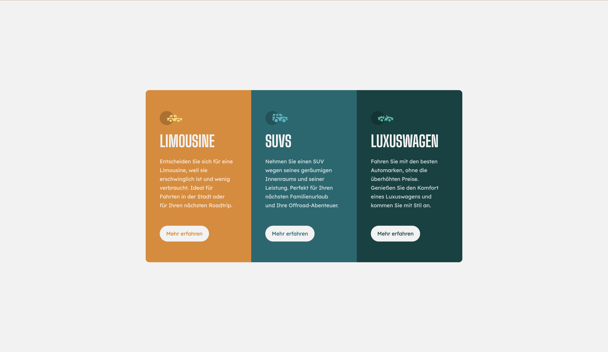
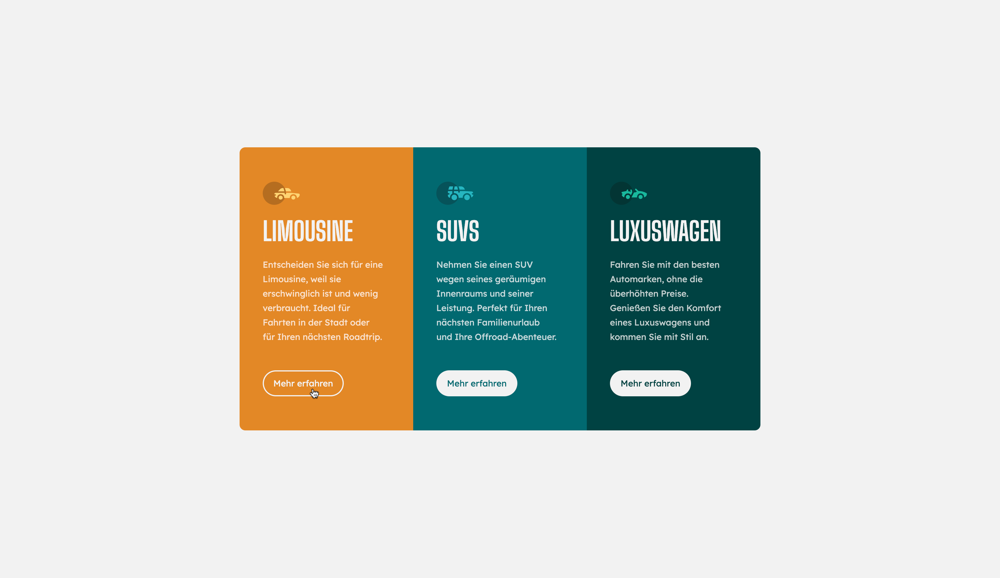

# Aufgabe

Halten Sie sich beim Design an den [Style-Guide](style-guide.md) und an die Fotos in der Aufgabenstellung.

Die Webseite sollte folgendermassen aussehen:

Beim hover-event verändert sich der Button:

## HTML
Im [File index.html](index.html) finden Sie sämtliche Texte der Webseite. 
Ergänzen Sie das File mit sämtlichen benötigten Tags, Klassen, IDs um das Design möglichst 1zu1 mit den Vorlagen umzusetzen.

### Bilder
Sämtliche Bilder finden Sie im Ordner [images](images)

## CSS
Verwenden Sie das [File style.css](css/style.css) um sämtliche CSS anpassungen zu machen.

## JS
Binden Sie das JavaScript-File im `index.html` ein. Vergeben Sie dem mittleren Button "Mehr erfahren" im Block SUVS die ID `activeButton` damit das JavaScript funktioniert.

## Favicon 
Fügen Sie das [Favicon](images/favicon-32x32.png) hinzu

## Publish
Richten Sie Github so ein, dass die Seite automatisch via Github-Pages zur Verfügung steht.

## Bewertung
Den Bewertungsraster zur Aufgabe finden Sie [hier](./bewertungsraster.md)